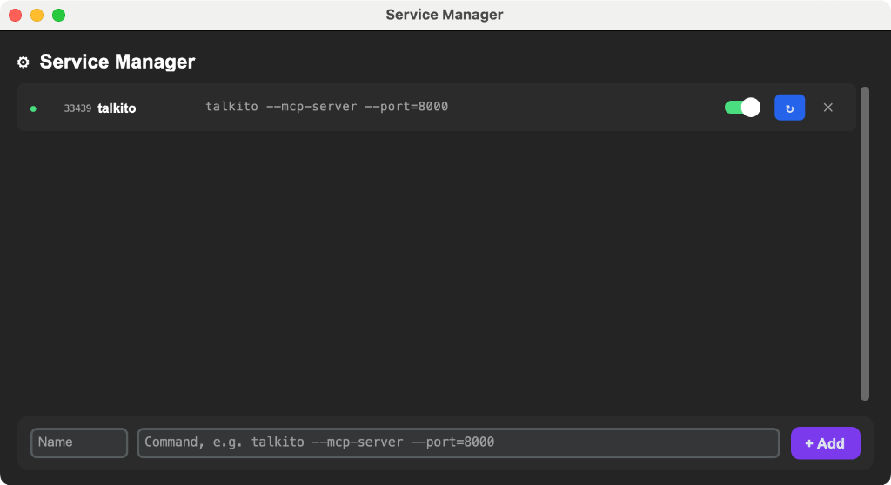

# MCP Service Manager

A sleek, lightweight GUI tool for managing background services and MCP servers on macOS.



## Features

-   **Process Control**: Start, Stop, and Restart services with a single click.
-   **Real-time Monitoring**: Visual status indicators (Running/Stopped) and PID tracking.
-   **Smart Conflict Detection**: 
    -   **Port Conflicts**: Warns if a port (e.g., 8000) is already occupied.
    -   **Duplicate Checks**: Prevents running multiple instances of the same service.
-   **Kill Switch**: Force-kill conflicting processes directly from the UI.
-   **Zero-Config**: Automatically detects environment paths (Conda/Homebrew).

## Installation

### Prerequisites
-   Python 3.10+ (Recommended: Miniconda or venv)
-   macOS (tested on Sequoia)

### Setup
1.  **Clone the repository**
    ```bash
    git clone <your-repo-url>
    cd mcp_srv_manager
    ```

2.  **Install Dependencies**
    ```bash
    pip install customtkinter Pillow packaging py2app
    ```

## Usage

### Run Directly
```bash
python main.py
```

### Build Standalone App
Generate a lightweight macOS application (`.app`):
```bash
python build_app.py
```
> **Note**: This builds in **Alias Mode**, creating a tiny application (<1MB) that uses your system's Python environment. The app will be located in `dist/Service Manager.app`.

## Configuration

Services can be added via the GUI or manually edited in `services.json`. 
A template is provided in `services.json.example`.

## License
MIT
